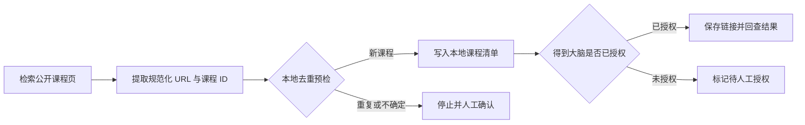

# 2026H2W9 作业：把一门得到课程接入得到大脑

- 提交人：深圳华为财经-Denney
- GitHub：denney0808
- 任务日期：2026-08-31 至 2026-09-06

## 1. 任务说明

本周主仓库尚未发布 `2026H2W9` 的独立任务文件，因此我按主分支日历和半年度规划完成：练习让浏览器、课程 URL 清单、去重预检与得到大脑按边界衔接，并交付本地课程清单与同步状态、脱敏工作流报告和可复用规则。

## 2. 课程与本地清单

我选择得到公开课程页中的免费课程：[脱不花·怎样成为高效学习的人](https://www.dedao.cn/course/LZ1RgB0EW3NK0wjsLbXkP7vj68pDeA)。

本地课程清单记录了课程名称、平台、规范化 URL、稳定课程 ID、来源、去重结果和同步状态。本地清单共 1 条，只使用公开信息，不包含账号凭据、个人笔记或业务数据。

## 3. 工作流

## 4. 去重预检

去重规则如下：

1. 移除 URL 片段、追踪参数和多余的尾部斜杠。
2. 优先从课程路径或查询参数提取稳定课程 ID。
3. 先按课程 ID 判断重复，再按规范化 URL 判断重复。
4. 标题和讲师仅用于疑似重复提醒，不作为唯一主键。
5. 结果为重复或无法确定时停止写入，交给人工确认。

我执行了两次预检：第一次面对空清单，判定为新课程并写入本地清单；第二次使用相同链接，成功根据课程 ID 识别为重复并阻止再次加入。这验证了工作流的最小幂等性。

## 5. 得到大脑同步状态

我核验了得到大脑公开的 AI Skill/CLI 入口，并运行官方 CLI 的环境诊断。CLI 可以执行，但当前环境没有连接得到大脑账号；保存链接需要浏览器授权。

因此本次同步状态为：**待人工授权（未写入得到大脑）**。

这是本次工作流中的明确边界：没有授权就停止，不读取或输出凭据，也不把“准备同步”写成“已经同步”。授权完成后，可从保存链接开始继续，并在回查成功后将状态更新为“已同步”。

## 6. 最终产出

- 本地课程清单：已完成，1 条。
- 去重预检：已完成两次，能够拦截重复课程。
- 得到大脑同步：待人工授权，未伪造完成状态。
- 脱敏工作流报告：已完成。
- GitHub 提交范围：只提交本报告，不上传本地清单、网页缓存、CLI 诊断输出或账号配置。

## 7. 哪一步最有用

最有用的是在外部写入前增加稳定课程 ID 去重。它把“是否需要保存”从主观判断变成可重复检查的规则，既减少重复内容，也让失败重试更安全。

## 8. 哪一步需要人来判断

人需要确认得到大脑的账号授权、目标知识库和外部写入范围。即使课程页面是公开的，也不能把账号内写入默认为已获授权；遇到登录、授权或目标位置不明确时应停下确认。

## 9. 下次会复用的一句话提示词

> 读取课程 URL 后先做规范化并提取稳定课程 ID，再按“课程 ID 优先、规范化 URL 其次”的规则去重；只有结果为新课程且目标账号已授权时才保存到得到大脑，随后回查并更新状态，否则停止并说明原因。

## 10. 脱敏说明

本报告只包含公开课程信息、通用流程、去重规则和同步状态；不包含密码、密钥、令牌、邮箱、客户资料、内部经营数据、个人笔记或本机绝对路径。
